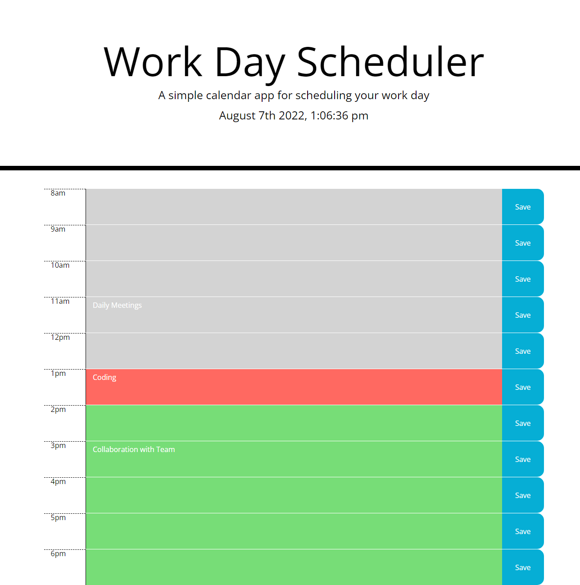

# Challenge 03
## Work Day Scheduler

 

### Description:
This is a workday scheduler. Users can view the workday, add events and save them. Events are saved to local storage. Past hours are displayed in grey, the current hour is displayed in red, and future hours are displayed in green. 

 
[Click here to view the page online](https://sewprano.github.io/05ch-workday-scheduler/)

 

